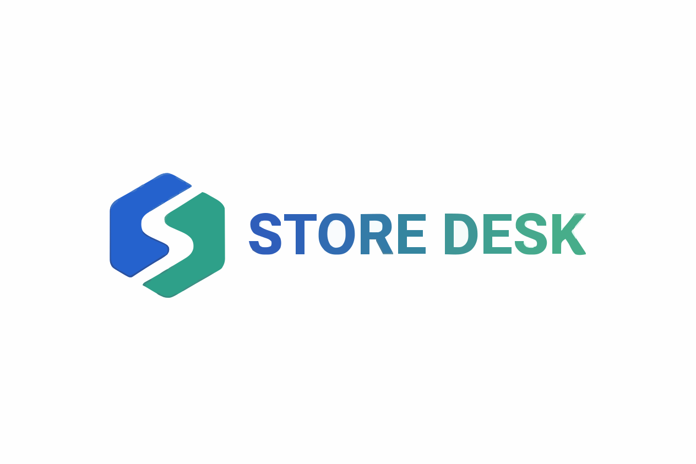
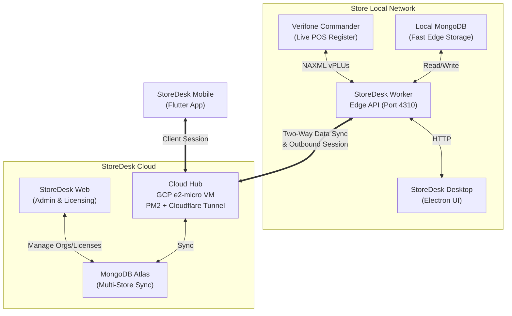

<p align="center">
  
</p>

# StoreDesk

**StoreDesk** is an edge-first desktop and mobile system for convenience stores and gas stations. It acts as the store's local command center for POS visibility, cataloging, vendor costs, and organization-licensed access. 

It is designed with a **hybrid local-first architecture**: the system runs through a local edge API (StoreDesk Worker) that talks directly to the local Verifone Commander register and local MongoDB. This protects the store from internet outages. An optional cloud control plane (StoreDesk Web & Cloud Hub) synchronizes data and handles multi-store licenses, relaying connections for mobile apps.

**Note:** StoreDesk is **not** an inventory system. It focuses on products, retail prices, vendor costs, Commander Price Book / POS reports, and Cost Analysis—not stock counts, warehouse locations, or reorder levels.

---

## 1. System Architecture & End-to-End Flow

### The Applications
StoreDesk is built as a single parent repository with submodules for each application component:

| App | Folder | Tech | Role |
| --- | --- | --- | --- |
| **StoreDesk Worker** | `store-desk-worker/` | Node.js + Express + local Mongo | **The Edge API.** Runs on the store PC (`0.0.0.0:4310`). This is the **Source of Truth** for the local store. It talks directly to Verifone Commander and local Mongo. |
| **StoreDesk** | `store-desk-electron/` | Electron + React | **Desktop Admin UI.** Runs on the store PC. Features Price Book, Cost Analysis, POS sales, and user access. |
| **StoreDesk Mobile** | `store-desk-mobile/` | Flutter | **Phone Helper.** Scan barcodes, search products, view vendor prices. Connects to the Worker via the Cloud Hub. |
| **StoreDesk Web** | `store-desk-web/` | Next.js + Atlas | **Cloud Control Plane.** Central admin for managing subscriptions, stores, provisioning users, and licensing. |
| **Cloud Hub** | `store-desk-cloud-backend/` | Node.js (WSS) + PM2 on GCP e2-micro VM | **Global Relay Engine.** Maintains persistent WebSocket channels (`wss://`) routing remote mobile/desktop requests to active Edge Workers. Cloudflare Tunnel provides SSL. No static IP needed. |

### End-to-End Diagram



---

## 2. Core Data Flows

### A. Verifone Commander Auto-Seeding
When the **StoreDesk Worker** starts on the local PC, it immediately connects to the Verifone Commander register to pull the latest pricing data.
1. **Bulk Fetch**: The worker uses `fetchCommanderPlusBulk`, fetching the entire PLU list in a single, high-speed request (`pageSize=9999`), taking ~5-20 seconds.
2. **Local Backup**: The raw XML payload is saved to local disk (`backups/commander/`) so the system can boot instantly in the future even if the Commander is offline.
3. **Delta Hash Check**: Each PLU is MD5-hashed (`name|dept|sell|sellUnit`). Only changed items are upserted to Mongo and pushed to Atlas — reducing sync traffic from ~15 MB to a few KB.
4. **Mongo Upsert**: Upserted using a compound unique key (`organizationId, storeId, upc, upcModifier`) to gracefully update existing records without duplicate key errors.

### B. Two-Way Cloud Sync
Data generated on the Edge (like newly entered Vendor Costs or fresh Commander PLUs) is synchronized to the Cloud seamlessly.
- **Worker → Atlas**: The Worker establishes an outbound WSS session to the **Cloud Hub** (persistent, no timeout cap on e2-micro). Only hash-changed PLU deltas are pushed, minimizing bandwidth.
- **Atlas → Worker**: The Hub executes a two-way sync, pulling down changes from Atlas and merging them into the local MongoDB.

### C. Live On-Demand Mobile Price Check
When a user scans an item in StoreDesk Mobile:
1. Mobile emits `LIVE_PRICE_REQ { storeId, upc, requestId }` over WSS to the Cloud Hub.
2. Hub routes the frame to the store's active Worker agent peer.
3. Worker queries local Mongo/Commander → returns `{ upc, sellPrice, vendorCost, margin }` in sub-100ms.
4. Hub relays `LIVE_PRICE_RES` back to the mobile client.

### D. Client Access (Desktop & Mobile)
- **Desktop**: Connects directly to the Worker over the local network (`http://127.0.0.1:4310`). Lightning fast and resilient to internet drops.
- **Mobile**: Users log into the Mobile app as an `AppUser` provisioned via StoreDesk Web. The app connects to the **Cloud Hub**, which securely relays requests to their assigned StoreDesk Worker.

---

## 3. Software Lifecycle (Setup-v1)

StoreDesk employs a strict, secure provisioning lifecycle designed to protect store data and manage multi-tenant environments.

### The Lifecycle States
```txt
not_installed → installed → awaiting_activation → active
                                      │            ├→ degraded
                                      │            ├→ suspended
                                      │            └→ updating
                                      └────────────→ awaiting_activation
```

### 1. Provisioning (StoreDesk Web)
- A central admin creates an **Organization** and a **Store** in StoreDesk Web.
- The admin provisions a **WorkerInstallation** for that store.
- A **Setup Key** (one-time, short-lived credential) is generated and emailed to the site contact.

### 2. Activation (Store PC)
- The user installs the StoreDesk Electron app on the store PC.
- Since the Worker is in `awaiting_activation`, the app asks the user to input their Emailed **Setup Key** and accept the EULA.
- The Worker redeems the setup key with StoreDesk Web. In exchange, it receives a permanent, sealed **Worker Credential**. The setup key is burned.
- The Worker reaches the `active` state and establishes its outbound connection to the Cloud Hub.

### 3. AppUser Login
- Staff do not use the Worker Credential. Instead, central admins provision **AppUsers** with specific **Assignments** (e.g., Jane has access to Store #12).
- Jane logs into StoreDesk Mobile or Desktop. Her client securely connects to the Cloud Hub, which verifies her assignment and routes her session to the correct active Worker.

---

## 4. Local Development

### Prerequisites
- Node.js & npm
- Flutter SDK (for mobile)
- Local MongoDB instance running on `mongodb://127.0.0.1:27017`

### Repository Setup
Since the apps are separated into submodules, you must clone recursively:
```bash
git clone --recurse-submodules https://github.com/TRUPALIX9/StoreDesk.git
cd StoreDesk
```
*(If already cloned: `git submodule update --init --recursive`)*

We use `develop` for integration and `production` for stable releases.
```bash
git checkout develop
git submodule foreach 'git checkout develop && git pull'
```

### Running the System Locally

**1. StoreDesk Worker (The Edge API)**
Must be running for the UI to work!
```bash
cd store-desk-worker
npm install
cp .env.example .env   # Set your COMMANDER_PASSWORD here!
npm run dev
```
*(Runs on `0.0.0.0:4310`)*

**2. StoreDesk Desktop (Electron UI)**
```bash
cd store-desk-electron
npm install
cp .env.example .env
npm run dev
```

**3. StoreDesk Mobile (Flutter App)**
```bash
cd store-desk-mobile
npm install
npm run setup:flutter
flutter run
```

---

## 5. Documentation Map

For deep dives into specific domains, refer to the following documentation:

| Doc | Contents |
|-----|----------|
| [`AGENTS.md`](AGENTS.md) | Full product spec + non-negotiables. |
| [`docs/system-map.md`](docs/system-map.md) | Gaps, dual-server notes, and detailed IA lock. |
| [`docs/architecture.md`](docs/architecture.md) | Detailed technical architecture notes. |
| [`docs/api-contract.md`](docs/api-contract.md) | HTTP / Hub surfaces and relay contracts. |
| [`docs/database-schema.md`](docs/database-schema.md) | Mongo Entity fields (Products, Variants, Vendors, etc). |
| [`docs/verifone-commander-price-book.md`](docs/verifone-commander-price-book.md) | Commander / Price Book / Cost Analysis E2E + API details. |
| [`docs/verifone-commander-reports.md`](docs/verifone-commander-reports.md) | Commander T-Log / closed daily & shift `vtransset` schema. |
| [`docs/release.md`](docs/release.md) | Branching, APK/AAB, and release checklists. |
