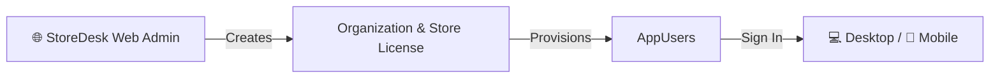

# StoreDesk Mobile — flows and distribution

Phone product in docs: **StoreDesk Mobile**. Launcher / Play label: **StoreDesk** (`com.storedesk`).

Brand: primary `#1A63F4`, secondary `#00A87B` — assets in parent `brand-kit/` and `store-desk-mobile/docs/brand/`.

Related: [`store-desk-mobile/README.md`](../store-desk-mobile/README.md) · [`how-storedesk-works.md`](./how-storedesk-works.md) · [`release.md`](./release.md)

---

## 1. Roles

| Piece | Job |
|-------|-----|
| StoreDesk (Electron) | Desktop ops (POS, Price Book, Cost Analysis). **No** invoice UI, **no** APK URL, **no** pairing QR |
| StoreDesk Worker | API the phone talks to (`:4310`); local Mongo; optional Hub agent |
| StoreDesk Mobile | Analytics, Reports, Price Book (PLU), and Cost Analysis after **AppUser** login |
| StoreDesk Web | Creates org + license and provisions organization users used by desktop/mobile |
| Cloud Hub | Later dual-mode path; not required for LAN beta |

The phone **never** connects to MongoDB or Commander directly.

---

## 2. Access model (license → org users)



There is **no** desktop Mobile Access page for APK download or pairing QR. Configuration is saved on the organization users created with the license.

---

## 3. Install paths

### A. Google Play beta / open testing

| Field | Value |
|-------|--------|
| Version name | `0.0.1` |
| Version code | `1` |
| Release name | `0.0.1-beta1` |
| Artifact | Signed **AAB** |
| Track | Internal testing first, then open testing |

**Open testing demo login** (no live Worker required):

| Field | Value |
|-------|--------|
| Email | `demo@demo.com` |
| Password | `Demo@123` |

This enables in-app **demo mode** with sample products, vendor prices, and POS.

```bash
cd store-desk-mobile
flutter build appbundle --release
```

---

## 4. Day-to-day journeys

### Connect / sign in

1. Open StoreDesk on the phone.
2. Sign in as an org AppUser (from Web license), or use demo credentials for Play review.
3. Access side drawer for navigation: Dashboard, Analytics, Sales Tax, Price Book, Reports, Settings.

### Dashboard & Analytics

1. **Dashboard**: View today's total sales. Tabbed donut charts for **TAX** (High/Low breakdown), **DEPT** (Sales by category), and **GAS** (Card vs Cash).
2. **Live Transactions**: Scroll through the latest receipts. Tap any row to see the **Transaction Detail** (line items, tax breakdown, payment method).
3. **Analytics**: Deep-dive into sales volume trends and daily metrics.

### Price Book & Cost Analysis

1. **Price Book List**: Search catalog or view "Recently Added" items.
2. **Item Detail**: Tap an item to see its two-tab workspace:
    - **PLU**: POS setup (Selling Price, Department, High/Low Tax Category).
    - **Cost Analysis**: Ranked list of vendor costs (Sam's Club, Global, Hackney, etc.) with **BEST COST** highlight.
3. **Edit**: Quick action to update item info or add new items via UPC scan.

### Reports (Verifone Commander)

1. Select **Reports** from the drawer.
2. Retrieve real-time data from Commander:
    - **Financial**: Z-Report (Close of Day), Sales Summary, Tax Report.
    - **Inventory**: Top Sellers, Price Book Export, Fuel Sales.
    - **Audit**: Void Audits, Cashier Performance.

### Sales Tax & Settings

1. **Sales Tax**: Automated tracking of High/Low tax obligations and net taxable sales.
2. **Settings**: 
    - Configure **GA Tax Profile** (Georgia Tax Center) for automated filing.
    - View saved GTC info (Account type, STI number).
    - Manage store connection and user session.

---

## 5. Out of scope on the phone

- Stock / inventory counts  
- Invoice upload  
- Direct MongoDB  
- Pairing QR / APK URL from desktop  
