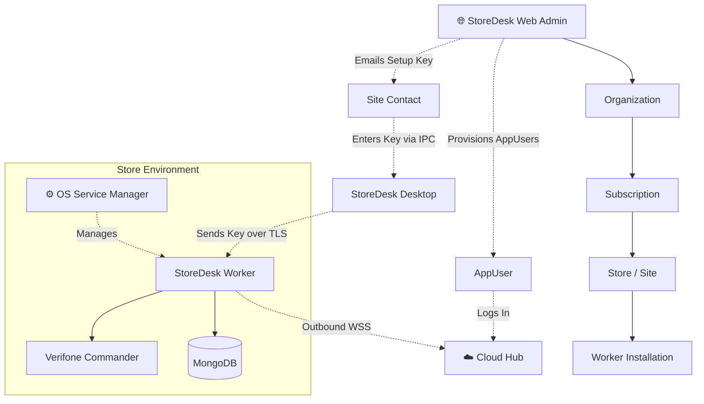

# StoreDesk system map & gap fill plan

Team review for `WO-20260713-system-flow-gap-redesign`.
Owners: eng-manager (coord), tech-lead, frontend-electron, backend-server, mobile-buddy, ui-ux-designer, docs-scribe.

Target setup/service contract: **`setup-v1`**, proposed for review in [`WO-20260728-store-setup-lifecycle`](./work-orders/WO-20260728-store-setup-lifecycle.md). Sections labeled “current” describe shipped behavior; sections labeled “target” are gates, not claims of implementation.

## Product IA (locked)

Desktop sidebar (current Electron nav):

1. Point of Sale (`/pos`)  
2. POS Reports (`/pos/reports`) — Ruby `vrubyrept`  
3. Transactions (`/pos/transactions`) — T-Log `vtransset`  
4. Price Book (`/price-book`) — live Commander PLUs  
5. Cost Analysis (`/cost-analysis`) — sell vs vendor costs  
6. Settings  

Commander E2E: [`verifone-commander-price-book.md`](./verifone-commander-price-book.md), [`verifone-commander-reports.md`](./verifone-commander-reports.md). LLM brief: [`storedesk-gemini-project-brief.md`](./storedesk-gemini-project-brief.md).

## Setup-v1 target map



Lifecycle:

```txt
not_installed → installed → awaiting_activation → active
active ↔ degraded
active → suspended → active
active|degraded → updating → active
updating → rollback → active|degraded
```

The Worker credential exists only in Worker sealed configuration. InternalAdmin, AppUser, setup key, Worker credential, refresh credential, and Hub session are separate identities/audiences. StoreDesk and StoreDesk Mobile authenticate as centrally provisioned AppUsers; Hub v1 receives short-lived assignment/audience/role/device-bound sessions. Atlas stores organizations, subscriptions, stores/installations, contact/display snapshots, AppUsers/UserAssignments, setup-key/credential hashes, EULA acceptances, session/device state, entitlement, presence, and audit metadata only—not local catalog, Commander, invoice, or vendor-price data.

Tenant relationship contract:

```txt
Organization ──< Subscription
      └────────< Store ──< WorkerInstallation
                             └── immutable organizationId/storeId/workerInstallationId
AppUser ──< UserAssignment >── exact Organization/Store/WorkerInstallation
InternalAdmin ── Web admin authorization/audit only
```

Organization is a tenant/container, not a login account. Contact email routes setup-key delivery and is not a principal. Central admins provision AppUsers and assignments; every session issuance, refresh, Hub relay, Worker request, presence, sync, audit, diagnostics, and admin operation verifies the complete hierarchy. One assignment auto-connects; multiple show only the authorized hierarchy selector.

Conditional setup/readiness:

```txt
Electron startup
  ├─ no activated Worker ─► resumable setup-key onboarding
  │    OS/privacy acknowledgements ─► EULA audit ─► install Worker
  │    ─► redeem emailed setup key ─► Worker seals credential
  │    ─► Hub/entitlement verify ─► first metadata bootstrap ─► ready
  └─ activated Worker ─► AppUser login
       ├─ one assignment ─► auto-connect
       └─ multiple assignments ─► authorized Organization/Store/Worker selector
Mobile ─► AppUser login only after assigned Worker ready
```

The first bootstrap/presence synchronizes exact IDs, display snapshots, entitlement/grace, protocol, time, credential status, and Hub reachability only. It never uploads local catalog, Commander, invoice, or vendor-price data.

QR/6-digit pairing, manual LAN URL entry, manual Worker ID selection, and pairing-primary UI/API are retired target behavior. Emergency local recovery, if retained, is disabled by default, elevated/audited, and outside onboarding. Offline/auth/Hub failure is messaged explicitly and never permits assignment bypass.

## Dual Express — why it exists (and why it’s a problem)

There are **not two products**. There is one API on port **4310**, but historically **two copies of the code**:

| Copy | Where | When it runs |
|------|--------|----------------|
| **StoreDesk Worker** (canonical) | `store-desk-worker/` | `npm run dev` in that repo — what StoreDesk Mobile + default Electron use |
| **Embedded Electron server** | `store-desk-electron/src/server/` | Only if you run `npm run dev:embedded` / `dev:server` inside Electron |

**Why it was added:** Early on, Electron could start its own API so desktop alone worked without the sibling server repo. That helped solo desktop demos.

**What you should use today:** one server — **`store-desk-worker`** on `4310`. Electron’s default `npm run dev` is `dev:external` and expects that.

**Why keep calling it a gap:** the embedded copy is a fork. Features (Price Book, Mongo blob persist) can land on one and not the other. Two processes fighting over `4310` also fails. Target: keep **only** `store-desk-worker`; treat Electron `src/server` as a migration source until removed.

## How the system connects

```txt
StoreDesk / StoreDesk Mobile
  └─ AppUser login → exact UserAssignment → short-lived Hub client session
       └─ Cloud Hub → outbound Worker room → Worker :4310
            ├─ local Mongo
            ├─ canonical Commander adapters
            └─ local files / downloads
```

| Client | Talks to | Must not |
|--------|----------|----------|
| Electron | Cloud Hub relay for selected assignment; protected local setup IPC only before activation | Web admin; manual Worker/LAN selection; Mongo/Atlas; Worker credential |
| StoreDesk Mobile | Cloud Hub relay for selected assignment | Web admin; pairing QR/code; manual LAN/Worker selection; Mongo/Atlas; Worker credential |

Worker still binds `0.0.0.0:4310` for its edge runtime, but primary clients do not ask users for that address. Default Electron development still expects external `store-desk-worker`; embedded `src/server` remains migration-only and can drift.

### Credential compatibility warning

Current Hub v0 accepts the same Atlas `agentKey` in both `agent` and planned `client` hello messages. That is not acceptable for setup-v1. Migration must:

1. Keep v0 only as temporary migration compatibility while Web/Hub/Worker gain AppUser assignment sessions; do not extend pairing/manual-connect behavior.
2. Rotate each activated installation to a Worker-only credential.
3. Provision AppUsers/UserAssignments and revocable refresh credentials.
4. Switch Hub to short-lived role/audience/organization/store/installation/assignment/device-bound sessions.
5. Remove shared `AGENT_KEY` client examples and reject Worker credentials in client role.

Worker credential rotation is a two-party flow: central Web support/admin authorizes an audited short-lived challenge, then the currently authenticated Worker proves installation possession and receives/seals the replacement. The initiating operator, Electron, Mobile, email, and admin APIs never receive the permanent credential.

## Core journeys

1. **Price Book (Commander)** — Live `vPLUs` list/search + local vendor overlays; Refresh (not Sync-first). Cost Analysis compares sell vs vendor costs. Details: [`verifone-commander-price-book.md`](./verifone-commander-price-book.md)  
2. **Invoice truth** — Upload → extract (stub) → Review → Confirm → VendorPrice history  
3. **POS ops** — Sheets sync → daily table/analytics → Georgia sale tax. Live Commander: **POS Reports** (Ruby) + **Transactions** (`vtransset`) — see [`verifone-commander-reports.md`](./verifone-commander-reports.md).  
4. **StoreDesk Mobile access** — target is AppUser enrollment/login → assignment auto-connect/selector → Hub relay. Existing QR `/link` behavior is legacy to remove, not a target.

## Identity note (tech-lead)

Excel POS catalog seed is **removed**. Remaining product surfaces:

| Model | Surfaces | Role |
|-------|----------|------|
| Product / Variant / VendorPrice | Invoice match, vendor prices, demo seed | AGENTS MVP cost history |
| Price Book entry | Desktop Price Book | Live Commander PLUs + manual rows |

Decide later: merge Price Book into Variant+VendorPrice, or keep both with clear UX labels.

## Gap backlog (ranked)

| Pri | Gap | Owner | Fill |
|-----|-----|-------|------|
| P0 | Dual Express servers drift | tech-lead | One server; thin or delete Electron embed |
| P0 | Setup/activation/service lifecycle absent | eng-manager + tech-lead | Deliver `WO-20260728-store-setup-lifecycle` in phases |
| P0 | Hub v0 shares `agentKey` across roles | tech-lead + backend-server | Worker-only credential + approved client credentials + short-lived v1 relay sessions |
| P0 | No bundled native service/update recovery | tech-lead + QA | Service manager, WinSW/launchd/systemd, sealed config, signed update/rollback |
| P0 | Control plane lacks hierarchy/AppUser assignment/EULA/setup-key model | tech-lead + web + QA | InternalAdmin-only Web, Organization/Store/Worker hierarchy, AppUser/UserAssignment, immutable EULA audit, provider-secured key delivery |
| P0 | Commander remains in Electron embed | backend-server + frontend-electron | Move Price Book/PLU/reports/transactions and secrets into Worker |
| P0 | Invoice extraction is sample-only | backend-server | Real PDF/OCR path |
| P0 | Mobile Home removed; inventory naming | mobile-buddy + ui-ux | Restore helper home; rename Products |
| P1 | Spec API aliases (`confirm-prices`, DELETE, mobile product/variant) | tech-lead + backend | Aliases + missing routes |
| P1 | Orphan Electron pages (Products CRUD, Variants, Price Comparison) | frontend-electron | Wire or delete |
| P1 | Mongo models unused (blob only) | tech-lead | Decide blob vs collections |
| P2 | Settings still holds Sheets/GTC | frontend-electron | Move under POS |
| P2 | Docs drift (`mobile-flow`, README) | docs-scribe | Update to real routes |
| P0 | Pairing/manual-connect target conflicts with AppUser flow | mobile-buddy + backend-server | Retire QR/6-digit/manual LAN/Worker selection; add assignment sessions |

## Commander migration target

The migration unit is behavior, not a copy of the Electron server:

1. Inventory current embedded Price Book, Commander PLU/status/lookup, Ruby POS Reports, T-Log Transactions, overlays/storage, auth, and tests.
2. Port protocol clients and business services to StoreDesk Worker; inject `COMMANDER_HOST`, user, and password from sealed Worker config.
3. Publish the same `/api/price-book*`, reports, and transactions behavior from Worker with explicit relay scopes and no Commander write-back.
4. Point StoreDesk at Worker, run parity/read-only fixtures and live opt-in Commander smoke, then remove `dev:embedded` production dependence.
5. Redact Commander URL credentials, auth headers, raw sensitive transaction fields, and passwords from logs/diagnostics.

StoreDesk Mobile and StoreDesk never connect to Commander directly.

## Service, paths, logs, and recovery target

Location decision: Electron manages OS services directly (via `sudo-prompt` and WinSW/native commands). The `store-desk-worker/packages/service-manager/` folder has been removed. StoreDesk Electron bundles/launches only the necessary configurations.

| Platform | Worker / Cloudflared service | Config and data | Logs / recovery |
|----------|------------------------------|-----------------|-----------------|
| Windows | `StoreDeskWorker` / `Cloudflared` via WinSW | `%ProgramData%\StoreDesk` data/config; versioned binaries under `%ProgramFiles%\StoreDesk\releases` | `%ProgramData%\StoreDesk\logs|diagnostics`; machine DPAPI or SYSTEM-only key file |
| macOS | `dev.storedesk.worker` / `dev.storedesk.cloudflared` via launchd | `/Library/Application Support/StoreDesk`; releases kept separately | `/Library/Logs/StoreDesk`; System Keychain or root-only key file |
| Linux | `storedesk-worker.service` / `storedesk-cloudflared.service` via systemd | `/etc/storedesk` config, `/var/lib/storedesk` data, `/opt/storedesk/releases` | `/var/log/storedesk`, `/var/lib/storedesk/diagnostics`; root-only key |

Recovery rules:

- Atomic AES-256-GCM config writes retain a previous authenticated envelope; invalid tags stop secret use and enter recovery.
- Update stages a signed artifact, drains Worker, snapshots compatible config metadata, starts the candidate, and gates on service/DB/API/optional dependency health.
- Failed gates enter `rollback`, restore the last known-good binaries/config schema, and preserve Mongo/upload data.
- Installation-key loss requires local elevated recovery, reactivation, and secret re-entry; it never falls back to plaintext.
- Diagnostics are bounded and redacted before export; inability to prove redaction fails closed.

## Rollout and E2E gates

1. **Contract/threat review:** state transitions, offline grace/suspension, cryptography, credential ownership, API/CLI, update signing.
2. **Web + Hub:** InternalAdmin hierarchy, AppUser/UserAssignment, EULA/setup-key audit, credential/session lifecycle, assignment-enforced relay.
3. **Service manager + Worker:** native services, sealed config, exact-ID setup-key redemption/rotation, metadata bootstrap/presence, diagnostics.
4. **Commander migration:** Worker parity and removal of embedded production dependency.
5. **StoreDesk + StoreDesk Mobile:** setup-key Electron onboarding, AppUser login/assignment UX, refresh/logout/offline handling, Hub transport, and pairing/manual-connect retirement.
6. **Release safety:** signed staged updates, automatic rollback, pilot rings, support diagnostics.

Required E2E matrix covers cross-tenant/assignment denial, immutable hierarchy binding and snapshot display, subscription installation limits, setup-email failure/reissue, setup-key invalid/expired/replay/concurrency, EULA tamper/reacceptance/audit, conditional Electron setup/app login, one/multiple/zero assignment behavior, Worker-only credential rotation/revocation, first-bootstrap/presence exact-ID reporting, AppUser/device/refresh/session disable/revoke/logout, retired pairing/manual-connect denial, explicit offline messaging, Hub relay isolation, Commander/database degradation, update/rollback, config corruption, key loss, redaction, and cross-version compatibility on Windows/macOS/Linux. Module CI is necessary but not sufficient; QA records unavailable platform or physical-device checks explicitly.

## Already applied this WO (frontend IA)

- Sidebar restored to product flow: Dashboard, POS, Products, Price Book, Vendors, Mobile, Settings  
- Default route → `/dashboard` (not only POS)  
- Settings “More tools” demoted to Pricing rules / Vendor prices / Lottery only  

## Next WOs to open

1. `WO-20260728-store-setup-lifecycle` — approve setup-v1 and split dependency-ordered delivery
2. `WO-…-single-server` — consolidate Express and migrate Commander
3. `WO-…-real-extraction` — replace sample invoice rows
4. `WO-…-mobile-home` — restore scan-first StoreDesk Mobile IA
5. `WO-…-catalog-unify` — Price Book vs Product/Variant decision + orphans

Explore notes: [Electron](d43b2eb6-4978-4a10-91d8-1860bd5294b5) · [Server](1225cdf3-450e-4e2b-a5d3-b6c0027b01bd) · [Mobile](4d9e0b5b-d483-474e-b368-22f34a9f8b92)
