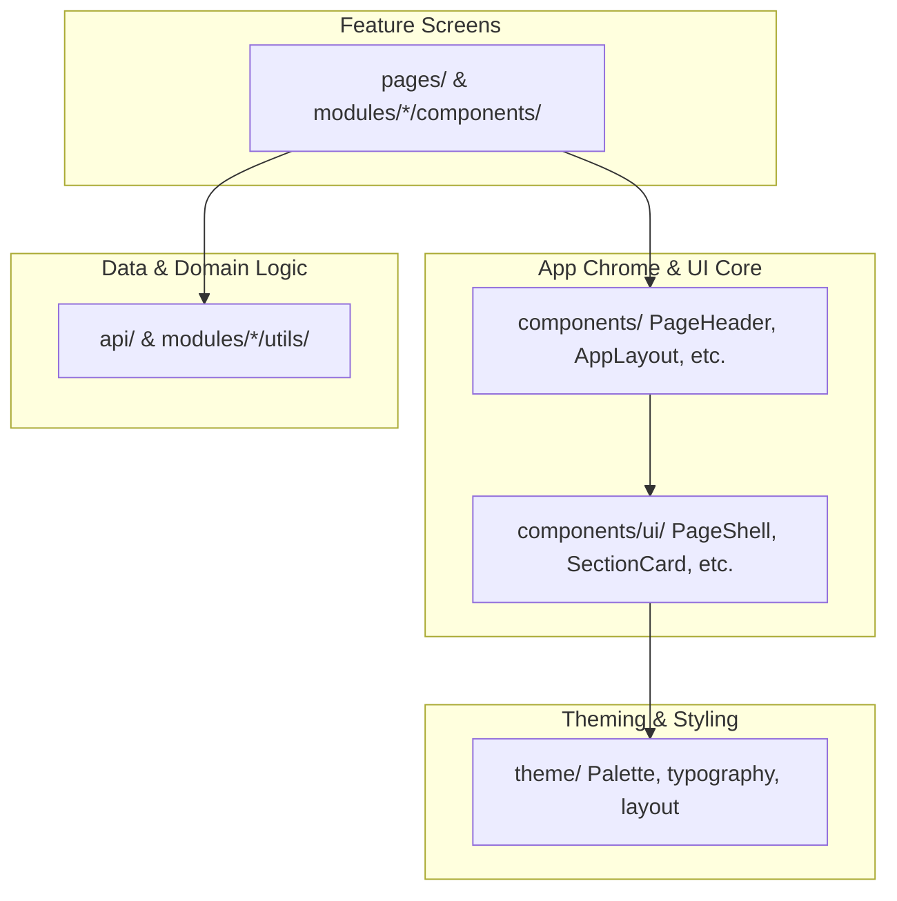
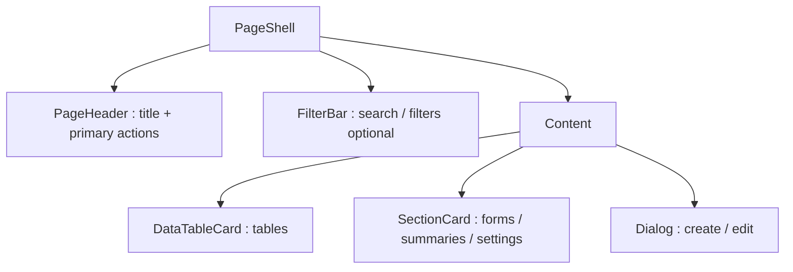

# StoreDesk UI Architecture

## Goals

- Consistent MUI admin UI across POS, Products, Price Book, Settings, and catalog tools
- Dense, scannable layouts — titles and data, not tutorial copy
- Central theme + shared layout primitives so pages stay thin

## Agent skills (Cursor + Codex)

| Skill / agent | Path | Role |
|-------|------|------|
| **agent-team** | `.cursor/skills/agent-team/` | Org model, management styles |
| **work-order** | `.cursor/skills/work-order/` | WO lifecycle |
| **handoff** | `.cursor/skills/handoff/` | Role/session transfer |
| **react-dev** | `.cursor/skills/react-dev/` | Typed React/TS |
| **mui** | `.cursor/skills/mui/` | Material UI sx/theme/components |
| **storedesk-ui** | `.cursor/skills/storedesk-ui/` | Page shells, density, no subtitles |
| **ui-ux-designer** | `.cursor/agents/ui-ux-designer.md` | Design critic |
| **frontend-electron** | `.cursor/agents/frontend-electron.md` | Implements Electron UI |

Team doc: `.cursor/TEAM.md`. Codex mirrors: `.codex/skills/`.

Rules: `.cursor/rules/react-dev.mdc`, `mui.mdc`, `storedesk-ui.mdc`, `mui-mcp.mdc`, `ui-ux-designer.mdc`, `agent-team.mdc`.

## Layers

## Page composition

## Content rules

1. **One title per section** — no subtitle explaining the section.
2. **Labels on controls** — meaning from fields, not paragraphs.
3. **Alerts only when needed** — blocked actions, errors, empty states.
4. **Flex/Stack first** — `Stack` for 1D; grid via `FormGrid` / `Box`.
5. **Flat surfaces** — outlined Paper; no glow KPI kits; brand blue `#1A63F4` / green `#00A87B` only (`brand-kit/`).
6. **One search** — page FilterBar only for that list.

## Brand & Aesthetic Styling

Assets: `brand-kit/` (canonical: `logo-mark.svg`, `logo-lockup-horizontal.svg`, `app-icon.ico`).  
Desktop copies live under `store-desk-electron/public/brand/`.

### Electron Glassmorphism Theme Architecture
- **Navigation Chrome**: Floating backdrop-blur header (`bg-white/80 backdrop-blur-xl`) with subtle gradient borders (`border-white/40`) and active nav pill chips matching Next.js web design aesthetics.
- **Palette**: Deep navy primary (`#0E43D8` / `#1A63F4`), vibrant emerald accent (`#00A87B` / `#28C88B`), soft gray page wash (`#F4F6F9`), dark slate typography (`#1E293B`).
- **Automated Sync Indicators**: Replaced manual PLU refresh buttons in `PriceBookPage.tsx` with automated live background sync status badges powered by Worker PLU auto-fetch.

## Agent workflow (UI change)

1. `eng-manager` opens WO (`review-gate` for redesigns).
2. `ui-ux-designer` critiques if visual.
3. `frontend-electron` implements (Desktop) or `mobile-flutter` (Mobile).
4. `qa-verifier` runs checks.
5. `docs-scribe` updates this file if the system changed.

---

## StoreDesk Mobile (Flutter) Architecture

### Design Principles
- **Modern Material 3**: High use of elevated cards, large border radii (16.0), and semantic icons.
- **One-Handed Navigation**: Side drawer (65% width) with compact brand header.
- **Data Density**: Tabbed analytics views, segmented controls, and clear hierarchical labels.
- **Consistent Branding**: Same blue/green tokens and horizontal logo lockup as Web.

### Key Components
- **MainShell**: Dynamic AppBar title + Store Selector + Side Drawer navigation.
- **Analytics Cards**: Tabbed segmented donut charts (Tax, Dept, Gas) with 2-column grid legends.
- **Transaction Audit**: Receipt-style detail views with deep-linking back to the catalog.
- **Price Book Workspace**: Unified Catalog -> Item Detail (PLU & Cost Analysis tabs) -> Edit Form flow.

### Implementation Stack
- **Framework**: Flutter / Dart (Null Safe)
- **State Management**: Riverpod (for repository providers and search state)
- **Routing**: go_router (StatefulShellRoute for tab/drawer persistence)
- **Charts**: fl_chart (custom donut implementations)
- **Icons**: flutter_lucide (standardized)
