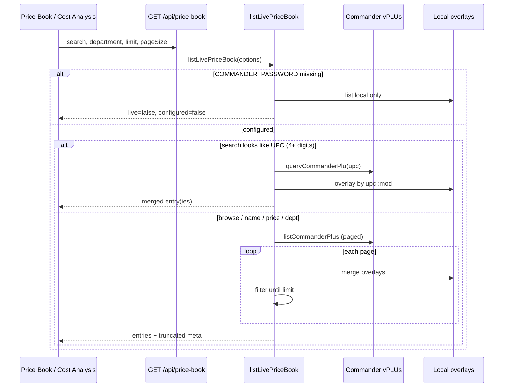
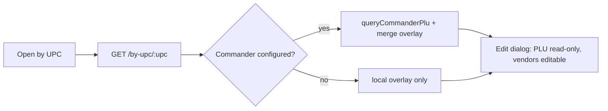
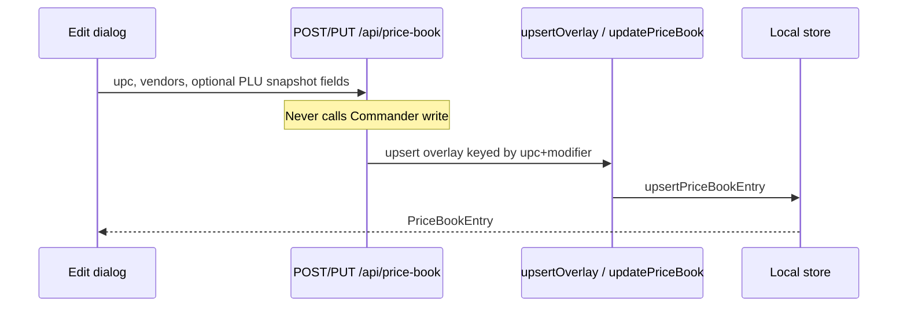

# Verifone Commander / Price Book integration

StoreDesk reads **live PLUs** from Verifone Commander (Sapphire / ConfigClient NAXML `vPLUs`) and merges them with **local vendor-cost overlays**. Selling price on Commander is never written back from StoreDesk.

| Item | Location |
|------|----------|
| Primary implementation | `store-desk-electron/` (embedded Express + UI) |
| Routes | `store-desk-electron/src/server/routes/priceBook.routes.ts` |
| Live list / merge | `store-desk-electron/src/server/services/priceBook.service.ts` |
| Commander protocol | `store-desk-electron/src/server/services/commanderPlu.service.ts` |
| Types | `store-desk-electron/src/shared/types.ts` |
| UI | `PriceBookPage.tsx`, `CostAnalysisPage.tsx`, `PriceBookFilterBar.tsx` |
| Probe scripts | `scripts/commander-*.js` |
| Related WOs | `WO-20260720-live-commander-price-book`, `WO-20260720-cost-analysis-page`, `WO-20260720-remove-excel-catalog-seed` |

**Runtime note:** Price Book APIs live on the **Electron embedded server** today (`npm run dev:embedded`). Default `npm run dev` talks to standalone `store-desk-worker`, which does **not** yet mirror these routes. See `docs/system-map.md` (dual Express gap).

---

## 1. Product capabilities

### What users can do

| Capability | Where |
|------------|--------|
| Browse live Commander PLUs (name, UPC, modifier, department, sell, sell unit) | **Price Book** (`/price-book`) |
| Search by description, UPC, or selling price; filter by department | Price Book + Cost Analysis |
| Refresh list from Commander (no Sync-first workflow) | Price Book **Refresh** |
| Open a PLU by UPC + modifier | Price Book “Open by UPC” |
| Save **vendor costs** (101, Sam’s Club, Global, Hackney, Gandhi, Custom) + optional expiry | Edit dialog → local overlay only |
| Add a manual overlay row (no Commander PLU) | Price Book **Add overlay** |
| Compare sell vs vendor case / per-item cost and margin | **Cost Analysis** (`/cost-analysis`) |

### In scope vs out of scope

| In scope | Out of scope |
|----------|----------------|
| Read-only Commander `vPLUs` | Commander `uPLUs` (or any write-back) — **not implemented** |
| Local vendor-cost overlays keyed by UPC + modifier | Excel / Hop-In POS catalog seed (removed) |
| Optional offline cache via `POST …/commander/sync` (API only; demoted UX) | Stock quantity / inventory |
| Live merge for Cost Analysis | StoreDesk Buddy Price Book (not wired to this API) |
| Electron embedded API | Port to `store-desk-worker` (follow-up) |

---

## 2. Architecture (E2E)

```txt
┌─────────────────────────────────────────────────────────────┐
│ StoreDesk Electron UI                                       │
│   /price-book  ·  /cost-analysis                            │
│   api.priceBook() / api.updatePriceBookEntry()              │
└────────────────────────────┬────────────────────────────────┘
                             │ HTTP  /api/price-book*
                             ▼
┌─────────────────────────────────────────────────────────────┐
│ Embedded Express (store-desk-electron/src/server)           │
│   priceBook.routes → priceBook.service → commanderPlu       │
│   Local store: priceBookEntries (overlays + optional cache) │
└───────────────┬─────────────────────────────┬───────────────┘
                │ HTTPS NAXML                 │ in-memory /
                │ vPLUs read-only             │ optional Mongo blob
                ▼                             ▼
┌───────────────────────────┐    ┌────────────────────────────┐
│ Verifone Commander        │    │ Local overlays             │
│ CGILink validate/release  │    │ vendor* + expiry           │
│ NAXML cmd=vPLUs           │    │ keyed upc::modifier        │
└───────────────────────────┘    └────────────────────────────┘
```

**Source of truth rules (merge):**

- Commander wins: `name` (description), `department`, `sellingPrice`, `sellUnit`, `upc`, `upcModifier`, `source: "commander"`.
- Local overlay wins: vendor cost slots + `expiryDate`.
- Synthetic live id when no overlay yet: `pb_{upc}_{upcModifier}`.

---

## 3. Data flows

### 3.1 Live list / search



Behavior highlights (`priceBook.service.ts`):

- Default `limit` 500, `pageSize` 50 (page size capped 1–200).
- Unfiltered browse stops after `limit` PLUs (snappy open); UI shows truncation and prompts search.
- Filtered browse pages until `limit` **matches** or Commander `ofPages` exhausted.
- UPC-like query: `^\d{4,}$` → targeted Commander lookup (modifier `0` on fast path).
- Manual-only overlays (no Commander PLU) that match filters are appended.

### 3.2 UPC lookup



Also available: `GET /api/price-book/commander/lookup` returns raw `CommanderPluRecord` without overlay merge.

### 3.3 Cost Analysis merge

Same `GET /api/price-book` as Price Book. Client util `utils/priceBookCost.ts` computes sell/ea, vendor per-item, best cost/ea, margin %. No separate cost API.

### 3.4 Overlay save



Success message in UI: vendor costs saved locally; Commander sell price unchanged.

---

## 4. Schema

### 4.1 `PriceBookEntry` (StoreDesk)

Defined in `store-desk-electron/src/shared/types.ts`:

| Field | Type | Notes |
|-------|------|--------|
| `id` | string | Overlay UUID-ish `pb_…` or synthetic `pb_{upc}_{mod}` |
| `upc` | string | Leading zeros stripped on Commander parse |
| `upcModifier` | string | Default `"0"` |
| `name` | string | From Commander `description` when live |
| `department` | string? | |
| `sellingPrice` | number | Retail / PLU price |
| `sellUnit` | number? | Pack size for sell/ea |
| `expiryDate` | string? | Overlay only |
| `source` | `"commander"` \| `"manual"` | Internal; not shown in UI filters |
| `vendorSamsClub` / `vendorGlobal` / `vendor101` / `vendorGandhi` | `{ quantity?, price?, pricePerItem? }` | `pricePerItem` derived on write |
| `vendorHackney` | above + `returnable?`, `suggestedRetailPrice?` | |
| `vendorCustom` | vendor line + optional `name` | |
| `createdAt` / `updatedAt` | ISO strings | |

### 4.2 `CommanderPluRecord` (parsed)

From `commanderPlu.service.ts` — only these tags are read from each `<domain:PLU>`:

| Parsed field | XML tag | Notes |
|--------------|---------|--------|
| `upc` | `upc` | Leading zeros removed |
| `upcModifier` | `upcModifier` | Numeric string (e.g. `000` → `"0"`) |
| `description` | `description` | Maps to entry `name` |
| `department` | `department` | |
| `price` | `price` | → `sellingPrice` |
| `sellUnit` | `SellUnit` | Default 1 |

Observed sample (probe download, not an official schema doc): `scripts/commander-downloads/plu-8037-0.xml` also contains `fees`, `pcode`, `taxRates`, `taxableRebate`, `maxQtyPerTrans` — **StoreDesk ignores** those fields today.

Namespace used in requests: `urn:vfi-sapphire:np.domain.2001-07-01`.

---

## 5. Environment & auth

### Commander env (`store-desk-electron/.env.example`)

| Variable | Required | Default / notes |
|----------|----------|-----------------|
| `COMMANDER_PASSWORD` | **Yes** to enable live | If unset → `configured: false`, local overlays only |
| `COMMANDER_HOST` | No | `https://192.168.31.11` |
| `COMMANDER_USER` | No | `MANAGER` |

Placeholders only in docs — never commit real passwords. TLS uses `rejectUnauthorized: false` (LAN appliances often use self-signed certs).

Dev tip: `npm run dev:embedded` loads embedded server + env.

### JWT / auth bypass

Price Book routes sit under `/api/price-book` and use the embedded server’s global auth middleware (`optionalGlobalAuth` / `requireAuth`).

| Flag | Behavior |
|------|----------|
| `NODE_ENV !== "production"` (default in dev) | JWT skipped (`isAuthDisabled()` true) unless overridden |
| `AUTH_DISABLED=true` | Force skip |
| `AUTH_DISABLED=false` | Require Bearer JWT even in development |
| `VITE_AUTH_DISABLED` | Frontend mirror for ProtectedRoute |

See `store-desk-electron/src/server/utils/isAuthDisabled.ts` and `src/auth/isAuthDisabled.ts`.

---

## 6. API documentation

Base path: **`/api/price-book`**. Mounted in `store-desk-electron/src/server/index.ts`.

Client wrappers: `store-desk-electron/src/api/client.ts` (`api.priceBook*`).

Errors: Zod validation failures and `HttpError` (e.g. 400/404) via shared error middleware; Commander failures typically surface as 500 with message text (e.g. login failed / not configured).

### `GET /api/price-book`

Live list + overlays (primary).

| Query | Type | Default | Purpose |
|-------|------|---------|---------|
| `search` or `q` | string | `""` | Name, UPC substring, or price amount |
| `name` | string | | Name contains |
| `upc` | string | | UPC/mod haystack |
| `department` | string | | Exact department match |
| `source` | `commander` \| `manual` | | Optional API filter (not exposed in UI) |
| `limit` | number | 500 | Max rows returned (cap 20000) |
| `pageSize` | number | 50 | Commander page size (1–200) |
| `maxPages` | number | uncapped if omit/≤0 | Cap Commander pages |

**Response:**

```ts
{
  entries: PriceBookEntry[];
  live: boolean;          // true when Commander was used
  configured: boolean;
  host: string | null;
  pageSize: number;
  ofPages: number;
  fetchedPages: number;
  truncated: boolean;
  departments: string[];  // union of seen depts (sorted)
}
```

### `GET /api/price-book/departments`

**Response:** `string[]` — departments from **local** overlay store only (`listPriceBookDepartments`). Live list response also returns a merged `departments` array for the current fetch.

### `GET /api/price-book/commander/status`

**Response:** `{ configured: boolean; host: string | null; username: string | null }`  
Does not return password.

### `GET /api/price-book/commander/lookup?upc=&modifier=0`

| Query | Required |
|-------|----------|
| `upc` | yes (400 if missing) |
| `modifier` | no, default `"0"` |

**Response:** `{ found: boolean; plu: CommanderPluRecord | null }`  
Throws if Commander not configured / login fails.

### `POST /api/price-book/commander/sync`

Optional **offline cache** (demoted; not primary UI). Still **read-only** `vPLUs`.

**Body (optional):** `{ pageSize?: number; maxPages?: number }`

**Response:**

```ts
{
  fetched: number;
  upserted: number;
  ofPages: number;
  fetchedPages: number;
  pageSize: number;
  host: string | null;
}
```

Preserves existing vendor overlays when upserting Commander snapshots (`upsertFromCommander`).

### `GET /api/price-book/by-upc/:upc?modifier=0`

**Response:** `{ found: boolean; entry: PriceBookEntry | null }`  
Live merge when configured; falls back to overlay if Commander unreachable.

### `GET /api/price-book/:id`

Returns local overlay by id. If missing, tries synthetic id `pb_{upc}_{mod}` → local find by UPC. Else **404**.

### `POST /api/price-book`

Create/upsert local overlay. **201** + `PriceBookEntry`.

**Body (Zod `writeSchema`):**

```ts
{
  upc: string;                 // required
  upcModifier?: string;
  name: string;                // required
  department?: string;
  sellingPrice: number;        // required
  sellUnit?: number;
  expiryDate?: string;
  source?: "commander" | "manual";  // default "manual" on POST
  vendorSamsClub?: { quantity?: number; price?: number };
  vendorGlobal?: { quantity?: number; price?: number };
  vendorHackney?: { quantity?: number; price?: number; returnable?: boolean; suggestedRetailPrice?: number };
  vendor101?: { quantity?: number; price?: number };
  vendorGandhi?: { quantity?: number; price?: number };
  vendorCustom?: { name?: string; quantity?: number; price?: number };
}
```

Does **not** write to Commander.

### `PUT /api/price-book/:id`

Partial body (same fields optional). Updates existing overlay, or if id is a live synthetic row with no store record yet, **creates** overlay when `upc` present; else **404**.

---

## 7. Verifone / Commander protocol notes

### Status of official documentation

**No official Verifone Commander / NAXML PDF or vendor URL is present in this repository** (no Verifone manuals under `docs/`; former ST-3 tax zips are unrelated and removed). Protocol behavior below is **reverse-engineered / observed** from:

- `store-desk-electron/src/server/services/commanderPlu.service.ts`
- `scripts/commander-plu.js`, `commander-login.js`, `commander-download.js`, `commander-probe.js`
- Sample XML under `scripts/commander-downloads/`

Do not treat these as certified Verifone API docs.

### Observed session flow (as implemented)

1. **Login / validate**  
   `GET {host}/cgi-bin/CGILink?cmd=validate&user=…&passwd=…`  
   Parse `<cookie>…</cookie>` from XML body. Fault message from `<(e:)?message>`.

2. **Read PLUs**  
   `POST {host}/cgi-bin/NAXML?`  
   Body (form-urlencoded style):  
   `cmd=vPLUs&cookie={cookie}\n\n{PLUSelect XML}`  
   Content-Type: `application/x-www-form-urlencoded`.

3. **PLUSelect XML** (domain NS `urn:vfi-sapphire:np.domain.2001-07-01`):

```xml
<domain:PLUSelect xmlns:xsi="http://www.w3.org/2001/XMLSchema-instance"
  xmlns:domain="urn:vfi-sapphire:np.domain.2001-07-01">
  <!-- optional -->
  <where kind="PLUNumber">8037</where>
  <where kind="PLUModifier">0</where>
  <pageSize>50</pageSize>
  <page>1</page>
</domain:PLUSelect>
```

4. **Response**  
   `<domain:PLUs page="…" ofPages="…">` with zero or more `<domain:PLU>` nodes.

5. **Release**  
   `GET {host}/cgi-bin/CGILink?cmd=releaseCredential&cookie=…`  
   Always attempted in `finally` after validate.

### Write commands

`scripts/commander-plu.js` mentions update gated behind `CONFIRM_WRITE` and is **not** exercised in StoreDesk app code. Electron services call **`vPLUs` only**. No `uPLUs` implementation in `store-desk-electron/src/server`.

### Probe / helper scripts

| Script | Role |
|--------|------|
| `scripts/commander-plu.js` | Query/list PLUs; documents NAXML body shape |
| `scripts/commander-login.js` | Auth + journal/period probes |
| `scripts/commander-download.js` | Closed DAILY `vtransset` + PLU export |

T-Log / closed daily & shift reports (separate from Price Book): [`verifone-commander-reports.md`](./verifone-commander-reports.md).
| `scripts/commander-download.js` | Daily tlog + PLU export samples |
| `scripts/commander-probe.js` / `commander-dig.js` | Endpoint discovery from ConfigClient |

---

## 8. UI pages

### Shared filters (`PriceBookFilterBar`)

| Control | Behavior |
|---------|----------|
| Search | Description **or** UPC **or** selling/vendor price amount (e.g. `1.49`) |
| Department | Dropdown; options from live response + `GET /departments` |
| Clear filters | Resets `q` + department |
| URL | `?q=` / `?department=` (AppBar search can target Price Book or Cost Analysis) |

No `source` (commander/manual) chips in UI.

### Price Book (`/price-book`)

| Column | Content |
|--------|---------|
| Name | PLU description |
| UPC | |
| Mod | Modifier |
| Dept | Department |
| Sell | `sellingPrice` |
| Unit | `sellUnit` |

Actions: **Refresh** (refetch live list), **Add overlay**, **Open by UPC** (+ Mod). Row click opens edit dialog (Commander PLU fields read-only when `source === "commander"`; vendor slots editable).

Former **Sync** button is removed from primary UX; `POST …/commander/sync` remains for optional offline cache via API/client helper only.

### Cost Analysis (`/cost-analysis`)

| Column | Content |
|--------|---------|
| Item | Name + department caption |
| UPC / Mod | |
| Sell | Case/pack sell; shows ×sellUnit when &gt; 1 |
| Sell/ea | `sellingPrice / sellUnit` when pack |
| 101, Sam's Club, Global, Hackney, Gandhi, Custom | Case price + per-item + margin % vs sell/ea |
| Best cost/ea | Lowest vendor per-item among filled slots |

Read-only comparison page (edits happen on Price Book dialog).

---

## 9. Related work orders

| WO | Status (as of docs pass) | Role |
|----|--------------------------|------|
| `WO-20260720-electron-price-book-plu` | **superseded** | Initial PLU wiring + catalog seed era |
| `WO-20260720-remove-excel-catalog-seed` | **done** | Removed Excel catalog SoT |
| `WO-20260720-live-commander-price-book` | **in_review** | Live SoT + Refresh; overlays |
| `WO-20260720-cost-analysis-page` | **in_review** | Cost Analysis + shared filters |
| `WO-20260722-commander-price-book-docs` | **done** | This documentation set |

---

## 10. Quick start (developers)

```powershell
cd store-desk-electron
# Copy .env.example → .env; set COMMANDER_PASSWORD (and HOST/USER if needed)
npm run dev:embedded
```

Open **Price Book** → list should show `live: true` behavior (Refresh works). Use **Cost Analysis** for vendor margins. Confirm with `npm run check`.
