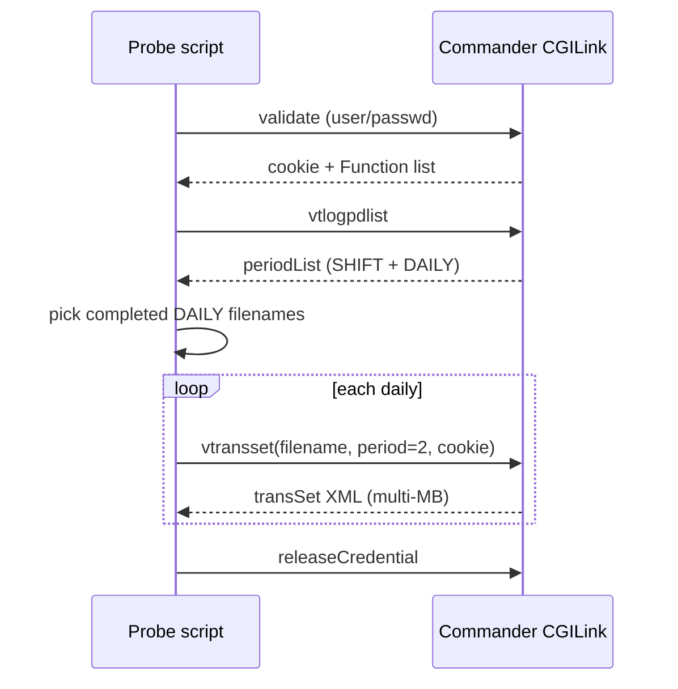
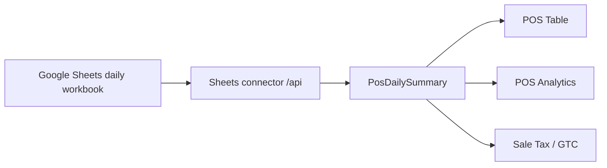
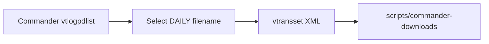

# Verifone Commander / portal reports (T-Log & periods)

How StoreDesk probe scripts fetch **closed daily / shift transaction sets** from Verifone Commander (Sapphire CGILink), what the multi-section XML contains, and how that relates to StoreDesk POS today.

| Item | Location |
|------|----------|
| Daily/shift download | `scripts/commander-download.js` |
| Auth + period list probe | `scripts/commander-login.js` |
| Period list inspect | `scripts/commander-inspect-metadata.js` |
| Sample period list | `scripts/commander-periods.xml` |
| Sample closed **DAILY** sets | `scripts/commander-downloads/daily-2026-07-16.311.xml`, `…17.312.xml`, `…18.313.xml` |
| Sample closed **SHIFT** set | `scripts/commander-tlog-2026-07-17.392-vtransset.xml` |
| Credential function catalog | `scripts/commander-auth.xml` (session cookie — **do not commit**) |
| PLU read path (separate) | `docs/verifone-commander-price-book.md` |
| POS UI (Sheets-backed) | `store-desk-electron/src/modules/pos/*` |

**Official Verifone documentation:** none is present in this repository. Everything below is **reverse-engineered / observed** from CGILink responses, Journal Browser probes, and saved XML. Do not treat this as a certified Verifone API guide.

---

## 1. Report kinds observed

Commander exposes many report-related **FunctionCmd** values on a successful `validate` (see `commander-auth.xml` / `commander-inspect-metadata.js`). StoreDesk scripts have **exercised only a subset**.

### 1.1 Exercised by StoreDesk scripts (evidence in repo)

| Kind | CGILink `cmd` | Purpose (observed) | How to fetch |
|------|---------------|--------------------|--------------|
| Login / session | `validate` | Returns credential cookie + allowed `Function` list | `GET /cgi-bin/CGILink?cmd=validate&user=…&passwd=…` |
| Release session | `releaseCredential` | Ends cookie session | `GET …&cmd=releaseCredential&cookie=…` |
| T-Log **period list** | `vtlogpdlist` | Lists SHIFT + DAILY periods with `filename` / `period` params | `GET …&cmd=vtlogpdlist&cookie=…` |
| **Period transaction set** (full) | `vtransset` | Closed (or current) period journal + sales XML (`transSet`) | `GET …&cmd=vtransset&filename=…&period=…&cookie=…` |
| Period transaction set (compressed) | `vtranssetz` | Same family; permission-dependent fallback in `commander-login.js` | Same params, `cmd=vtranssetz` |
| PLU catalog (read) | `vPLUs` | PLU dataset (Price Book path; also CGI form without NAXML body in download script) | See Price Book doc; download script also calls `cmd=vPLUs` |

`commander-download.js` specifically: validate → `vtlogpdlist` → filter completed **DAILY** periods → `vtransset` for each → optional `vPLUs`.

### 1.2 Exposed on credential but **not** implemented in StoreDesk app/scripts

From FunctionCmd display names on validate (non-exhaustive; report-ish `v*` / close commands):

| FunctionCmd | Display (from auth XML) | Notes |
|-------------|-------------------------|--------|
| `vcashierrept` / `vcashierpdlist` | Cashier Reports / period list | Separate from T-Log `vtransset` |
| `vattendantrept` / `vattendantpdlist` | Attendant reports | |
| `vfueltotals` / `vfueltotalsz` | Fuel Totals Report | Not the same as fuel lines inside `vtransset` |
| `vpayrollrept` / `vpayrollrept2` + pdlist | Payroll Reports | |
| `vposjournal` / `vmwsposjournal` | NAXML POSJournal | Different surface than T-Log period set |
| `vMovement` | NAXML movement reports | |
| `vreportlist` / `vreportpdlist` / `vreportcfg` / `vreportstatus` | Configurable report list / manager review | |
| `vrubyrept` | Ruby Reports | |
| `vviperrept` / `vviperpdlist` | Viper reports | |
| `vmobilereport*` | Mobile report list/category | |
| `vtilleventreport` | Till Event Reports | |
| `vesafecashierrept` | ESafe Cashier Reports | |
| `vcwpaypointpdrept` | Carwash paypoint period report | |
| `cclosepdnow` | Close Period Now | **Close** action — not used by StoreDesk |
| `cclosedaynow` | Close Day Now | **Close** action — not used by StoreDesk |
| `ccwpdclose` | Carwash Paypoint Period Close | |

**Gap:** no StoreDesk code calls these. Periods XML from `vtlogpdlist` on this site lists only **SHIFT (sysid=1)** and **DAILY (sysid=2)** — no MONTHLY/WEEKLY entries in the saved sample.

---

## 2. Period model (SHIFT / DAILY / HOUR)

### 2.1 Period list (`vtlogpdlist`)

Root: `<domain:periodList>` with many `<periodInfo>` nodes.

Each `periodInfo` (observed):

| Field | Path | Example |
|-------|------|---------|
| Period type id | `<vs:period sysid="N"/>` | `1` = SHIFT, `2` = DAILY |
| Label | `<name>` | `2026-07-17.312` or `current` |
| Description | `<desc>` | `2026-07-17 (DAILY-312)` / `Current DAILY` |
| Report param `period` | `<reportParameter name="period">` | `"1"` or `"2"` (same as sysid in samples) |
| Report param `filename` | `<reportParameter name="filename">` | `2026-07-17.312` or `current` |

Saved sample (`commander-periods.xml`, ~182 entries): **91 SHIFT + 91 DAILY** including one `current` each. **No MONTHLY** string matches.

Filename pattern used by download filter:

```txt
YYYY-MM-DD.<seq>     e.g. 2026-07-17.312
```

`commander-download.js` keeps DAILY rows where:

- `sysid === '2'` and `period === '2'`
- `filename !== 'current'`
- filename matches `/^\d{4}-\d{2}-\d{2}\.\d+$/`
- first **3** completed dailies

### 2.2 Hierarchy inside a transaction set

Every financial/journal header repeats:

```xml
<period level="0" seq="…" name="HOUR"/>
<period level="1" seq="…" name="SHIFT"/>
<period level="2" seq="…" name="DAILY"/>
```

So a **closed daily** file embeds the active shift/hour sequences for events in that day. Closing emits `periodClose` for SHIFT then DAILY (see §3).

### 2.3 Monthly / period close — status

| Topic | Evidence |
|-------|----------|
| Fetch monthly T-Log via `vtlogpdlist` | **Not present** in saved period list (SHIFT+DAILY only) |
| Close day / close period from StoreDesk | **Not implemented**; auth lists `cclosedaynow`, `cclosepdnow` |
| Aggregate month in StoreDesk POS | Done from **Google Sheets** `PosDailySummary` rows (date range), not Commander |

To explore monthly later: probe `vperiodlist` / `vreportpdlist` / payroll period lists — **untested** here.

---

## 3. Closed daily shift / daily report (deep dive)

### 3.1 How to obtain (as implemented)



Equivalent manual params:

```txt
GET https://<COMMANDER_HOST>/cgi-bin/CGILink?cmd=vtransset
  &filename=2026-07-17.312
  &period=2
  &cookie=<cookie>
```

For a **closed SHIFT** file, use `period=1` and a SHIFT filename (e.g. `2026-07-17.392`) — sample saved as `commander-tlog-2026-07-17.392-vtransset.xml`.

TLS: scripts use `rejectUnauthorized: false` (LAN self-signed).

### 3.2 What “closed daily” means in the XML

Sample daily `2026-07-17.312`:

| Attribute / node | Value (sample) |
|------------------|----------------|
| Root | `<transSet periodID="2" periodname="DAILY" longId="2026-07-17" shortId="312" site="0508">` |
| `openedTime` | `2026-07-16T02:05:06-04:00` |
| `closedTime` | `2026-07-17T02:05:06-04:00` |
| Bookends | `<startTotals>…</startTotals>` then thousands of `<trans>…` then `<endTotals>…` |
| Final events | `periodClose` SHIFT-392, then `periodClose` DAILY-312 |

Same calendar day on **SHIFT** sample uses `periodID="1" periodname="SHIFT" shortId="392"` with matching open/close times — i.e. this store’s “day” aligns with one shift close in the sample window.

**Day sales volume (grand totalizers):**  
`endTotals.overallSales − startTotals.overallSales` ≈ **11511.69** for the 2026-07-17 daily sample (running site grand totals, not a simple “ring sales only” field — still useful as a period delta).

### 3.3 Multi-section layout (how to leverage)

Think of `vtransset` as **one envelope with many section types**, not a single flat “Z report” table:

```txt
transSet
├── openedTime / closedTime
├── startTotals          ← site grand totals at period open
├── trans*               ← mixed event stream (ordered)
│   ├── journal          ← security, login, DCR, fuel events (text)
│   ├── sale / network sale / void
│   ├── openCashier / closeCashier
│   └── periodClose      ← SHIFT then DAILY markers
└── endTotals            ← site grand totals at period close
```

**How to leverage sections together:**

| Goal | Sections to use |
|------|-----------------|
| Confirm day is closed | Root `closedTime` + trailing `periodClose` DAILY |
| Period sales delta | `endTotals.* − startTotals.*` (overall / inside / outside) |
| Inside vs outside / fuel island | Totals fields + `trLine` fuel vs PLU |
| High vs low tax buckets | `trValue/trTax/taxAmts` (`HIGH TAX` / `LOW TAX`) |
| Tender mix (cash/credit/debit) | `trPaylines/trpPaycode` (`CASH`, `CREDIT`, `DEBIT`, `Change`) |
| Department / category mix | `trlDept`, `trlCat` on lines |
| Lottery | Dept lines `trlDept` **Lotto** (dept 35 in sample) — sparse vs Sheets “lottery” column |
| Fuel gallons / grade | `trLine` `preFuel` / `postFuel` + `trlFuel` (`fuelVolume`, `fuelProd`, `fuelPosition`) |
| Cashier accountability | `openCashier` / `closeCashier` (`beginCash`, ticket range, times) |
| Card network detail | `network sale` + masked `trpCardInfo` |
| Noise / audit | `journal` `trjText` (`SECURE USER`, `LOGIN/LOGOUT`, `DCR EVENT`, …) |

There is **no** separate XML chapter titled “Department Report” inside `vtransset` — department totals are **derived by aggregating** `trLine` nodes (or by calling other FunctionCmds like cashier/fuel reports, untested).

### 3.4 Transaction type census (daily sample 2026-07-17.312)

| `trans/@type` | Count | Role |
|---------------|------:|------|
| `journal` | 3591 | Text audit / events |
| `network sale` | 414 | Tendered sale with card/network path |
| `sale` | 155 | Sale (often cash / non-network) |
| `void` | 12 | Voids |
| `openCashier` | 6 | Drawer open |
| `closeCashier` | 2 | Drawer close summary |
| `periodClose` | 2 | SHIFT + DAILY close markers |

### 3.5 Schema appendix — envelope & totals

```xml
<transSet periodID="2" periodname="DAILY" longId="YYYY-MM-DD" shortId="{seq}" site="{store}">
  <openedTime>ISO-8601</openedTime>
  <closedTime>ISO-8601</closedTime>
  <startTotals> … </startTotals>
  <!-- trans stream -->
  <endTotals> … </endTotals>
</transSet>
```

**Totals fields** (both `startTotals` and `endTotals`, observed):

| Element | Meaning (inferred from names + usage) |
|---------|----------------------------------------|
| `insideSales` / `insideGrand` | Inside sales / grand |
| `outsideSales` / `outsideGrand` | Outside (e.g. fuel island) sales / grand |
| `attendantInsideSales` / `…Grand` | Attendant buckets (0.00 in sample) |
| `attendantOutsideSales` / `…Grand` | |
| `overallSales` / `overallGrand` | Combined |

### 3.6 Schema — common `trHeader`

Present on most non-trivial `trans` nodes:

| Element / attr | Notes |
|----------------|-------|
| `termMsgSN[@type]` | `JOURNAL` or `FINANCIAL`; register terminal id |
| `trTickNum` / `posNum` / `trSeq` | Ticket identity (sales) |
| `trUniqueSN` | Unique sale number |
| `period[@level @seq @name]` | HOUR / SHIFT / DAILY |
| `date`, `duration` | Event time; duration seconds on sales |
| `till`, `cashier[@sysid @empNum @posNum @period @drawer]` | Cashier context |
| `storeNumber`, `physicalRegisterID`, `uniqueID` | Site / register / event id |

### 3.7 Schema — `sale` / `network sale`

Outer: `<trans type="sale|network sale" recalled="false">`.

**`trValue` (ticket totals):**

| Field | Sample role |
|-------|-------------|
| `trTotNoTax` | Merch before tax |
| `trTotWTax` | With tax |
| `trTotTax` | Tax amount |
| `trTax/taxAmts/taxAmt|taxRate|taxNet[@cat]` | Per tax category (`HIGH TAX`, `LOW TAX`) |
| `trCurrTot` | Currency total |
| `trSTotalizer` / `trGTotalizer` | Sale / grand totalizers for ticket |
| `trFstmp*` | Food stamp totals when present |
| `custDOB` | Age verification skip/pass |

**`trLines` / `trLine[@type]` census:**

| `trLine/@type` | Count (sample day) | Contents |
|----------------|-------------------:|----------|
| `plu` | 510 | UPC, desc, dept, qty, prices, tax |
| `postFuel` | 229 | Completed fuel with `trlFuel` volume/grade |
| `preFuel` | 173 | Prepay deposit (`FUEL DEPOSIT` dept 9999) |
| `dept` | 82 | Department ring (e.g. Lotto) |
| `void plu` | 2 | Voided PLU |

**PLU line fields (observed):** `trlDept`, `trlCat`, `trlNetwCode`, `trlQty`, `trlSign`, `trlSellUnit`, `trlUnitPrice`, `trlLineTot`, `trlDesc`, `trlUPC`, `trlModifier`, `trlUPCEntry`, `trlTaxes`, `trlFlags` (e.g. `trlFstmp`, `trlPLU`, `trlBdayVerif`).

**Fuel (`postFuel`) extras:** `trlFuel` with `trlFuelSeq`, `fuelPosition`, `trlFuelDepst`, `fuelProd`, `fuelSvcMode`, `fuelMOP`, `fuelVolume`, `basePrice`.

**Paylines:** `trPaylines/trPayline[@type=sale]` → `trpPaycode[@mop]` text `CASH|CREDIT|DEBIT|Change`, `trpAmt`, optional masked `trpCardInfo` (account, auth, batch, host `ShellPayment`, etc.).

Sample mop mix (paycode text): CREDIT 311, CASH 158, DEBIT 104, Change 69.

### 3.8 Schema — cashier & period close

**`openCashier`:** `cOpenTime`, `cashierPeriod`, `beginCash` (e.g. 300.00).

**`closeCashier`:** `cOpenTime`, `cCloseTime`, `beginTicket`/`endTicket`, `ticketCount`, `beginCash`, `beginFoodStmp`.

**`periodClose`:** `periodName` (`SHIFT`|`DAILY`), `periodType` (`1`|`2`), `periodSeq`, `date`, `storeNumber`.

### 3.9 Schema — journal text

`trans type="journal"` → `trJournal/trjText[@type]`. Top types in sample: `SECURE USER`, `DCR EVENT`, `LOGIN/LOGOUT`, `OTHER`, `SALES EVENT`, `ERROR CORRECT`, `PRICE CHECK`, `CHANGE QTY`, `FUEL EVENT`.

Useful for audit; usually **not** for sales KPIs.

---

## 4. Flows vs StoreDesk POS (current vs opportunity)

### 4.1 Current StoreDesk POS path (implemented)



`PosDailySummary` fields (`shared/types.ts`): `highTax`, `lowTax`, `saleTax`, `totalSales`, `gas`, `lottery`, `creditCard`, `lotteryPayout`, `clTotal`, `cash`, `cashPayout`, `cashExpenses`, … sourced as `file | google_sheets | manual` — **not** from Commander `vtransset`.

**No** Electron/server parser for `transSet` XML exists today (grep: no `vtransset` / `vtlogpdlist` in `store-desk-electron/src`).

### 4.2 Probe-only Commander path (scripts)



### 4.3 Unused opportunity (not built)

Map closed daily `vtransset` → one `PosDailySummary` (or richer report):

| StoreDesk field | Possible Commander derivation (hypothesis — needs product decision) |
|-----------------|---------------------------------------------------------------------|
| `date` | `transSet/@longId` or business date from `closedTime` |
| `highTax` / `lowTax` | Sum `taxNet` or taxable bases by `HIGH TAX` / `LOW TAX` |
| `totalSales` | Sum `trTotWTax` on sale types, or totals delta |
| `gas` | Sum `postFuel` `trlLineTot` / `fuelVolume` |
| `creditCard` | Sum paycodes CREDIT+DEBIT |
| `cash` | Sum CASH paycodes (careful with Change) |
| `lottery` | Sum dept **Lotto** lines |

Also possible: department flash, fuel by grade, cashier reports — either aggregate `vtransset` or call dedicated FunctionCmds.

---

## 5. Env & safety

| Variable | Role |
|----------|------|
| `COMMANDER_HOST` | Default in scripts `https://192.168.31.11` |
| `COMMANDER_USER` | Default `MANAGER` |
| `COMMANDER_PASSWORD` | **Required** — never commit |

Do **not** commit: `commander-auth.xml` (live cookie), any file with embedded passwords. Probe scripts must read password from env only.

---

## 6. Related docs

| Doc | Relation |
|-----|----------|
| [`verifone-commander-price-book.md`](./verifone-commander-price-book.md) | Live PLU `vPLUs` / NAXML (different cmd surface; same host/auth cookie pattern) |
| [`how-storedesk-works.md`](./how-storedesk-works.md) | POS journeys (Sheets today) |
| [`system-map.md`](./system-map.md) | Dual Express / POS ops gap |

---

## 7. Sample artifacts checklist

| File | Contents |
|------|----------|
| `scripts/commander-periods.xml` | Full SHIFT+DAILY period list snapshot |
| `scripts/commander-downloads/daily-*.xml` | Closed DAILY `vtransset` |
| `scripts/commander-tlog-*-vtransset.xml` | Closed SHIFT `vtransset` |
| `scripts/commander-downloads/plu-*.xml` / `plus-page1-50.xml` | PLU samples (Price Book) |
